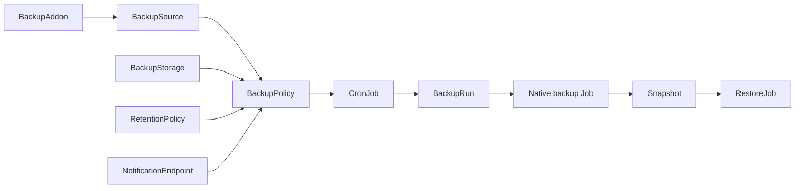

# dataprotection v2

`dataprotection v2` 是一套面向 Kubernetes 的数据保护控制面。

如果你是第一次接手这个项目，可以先记住一句话：

**它现在已经是一个可以实际安装、调度、执行、沉淀快照的 alpha 级备份恢复平台；当前最适合先跑通的是 MySQL + NFS / MinIO 这两类后端场景。**

这份 README 的目标不是只讲设计，而是让你直接学会怎么安装、怎么做 NFS 备份、怎么做 MinIO 备份、怎么做恢复、怎么验证结果。

## 1. v2 和旧版最大的区别

v2 不再把所有业务逻辑硬塞进 core 里，而是拆成四层：

- 存储平面
  只管理 `NFS` 和 `MinIO`
- 调度平面
  `BackupPolicy -> CronJob -> BackupRun -> native Job`
- 插件平面
  业务数据源通过 `BackupAddon` 接入
- 通知平面
  Operator 把标准事件发到 `notification-gateway`

当前资源模型已经是：

- `BackupAddon`
- `BackupSource`
- `BackupStorage`
- `RetentionPolicy`
- `BackupPolicy`
- `BackupJob`
- `RestoreJob`
- `Snapshot`
- `NotificationEndpoint`

也就是说，**现在要用 v2，就不要再按旧版的 `BackupRepository / BackupRun / RestoreRequest` 心智来理解了。**

## 2. 当前真实可用范围

当前最值得先跑通的能力：

- Operator 离线安装
- `BackupAddon` 外接业务备份恢复模板
- `BackupSource` 描述数据源
- `BackupStorage` 描述 NFS 或 MinIO 后端
- `RetentionPolicy` 描述成功快照和失败执行的保留策略
- `BackupPolicy` 定时备份
- `BackupJob` 手工一次性备份
- `Snapshot` 自动沉淀
- `RestoreJob` 按 `snapshotRef` 恢复
- `NotificationEndpoint` webhook 通知

当前最推荐验证的数据面：

- MySQL addon
- NFS 后端
- MinIO 后端

当前边界：

- 这是 alpha，可用但仍在演进
- 其他 driver 目前更偏 addon 预留，不要默认当成“已经全面交付”
- 文档和样例现在以 MySQL 路径最完整

## 3. 先理解每个资源是干什么的

- `BackupAddon`
  备份恢复插件模板。它定义用什么镜像、什么命令把业务数据导出到 `/workspace/output`，以及如何从 `/workspace/input` 恢复。
- `BackupSource`
  一个具体数据源，例如某个 MySQL 实例。它引用一个 `BackupAddon`。
- `BackupStorage`
  一个备份后端，当前支持 `nfs` 和 `minio`。
- `RetentionPolicy`
  规定保留多少成功快照，以及保留多少失败执行历史。
- `BackupPolicy`
  定时策略。它可以引用一个 source 和多个 storage。
- `BackupJob`
  手工一次性备份。它一次只对应一个 storage。
- `Snapshot`
  成功备份后沉淀下来的、可恢复的资产记录。
- `RestoreJob`
  从某个 `Snapshot` 恢复。
- `NotificationEndpoint`
  事件通知的目标 webhook。

可以把主链路理解成下面这样：



## 4. 核心执行逻辑

这是 v2 最重要的理解点：

- `BackupAddon` 只负责业务数据的导入导出
- core helper 负责和远端 `NFS / MinIO` 存储交互

备份时：

1. `storage-preflight` 先探测存储可用性
2. addon 把业务数据写到 `/workspace/output`
3. core helper 打包成统一快照产物
4. core helper 上传到 `NFS / MinIO`
5. controller 创建或更新 `Snapshot`

恢复时：

1. `storage-preflight` 先探测存储可用性
2. core helper 下载快照并解包到 `/workspace/input`
3. addon 从 `/workspace/input` 读取并恢复

这意味着：

- addon 不需要自己实现上传 NFS / MinIO
- addon 不需要自己维护 `latest`
- addon 不需要自己做 retention
- addon 不需要自己创建 `Snapshot`

更详细的执行流可以继续看：

- [docs/EXECUTION-FLOW.zh-CN.md](C:/Users/yuanyp8/Desktop/archinfra/data-protection-operator/docs/EXECUTION-FLOW.zh-CN.md)

## 5. 安装 Operator

离线安装器默认会：

- 准备镜像
- 安装 CRD
- 安装 RBAC
- 安装 controller Deployment
- 安装 notification gateway

帮助：

```bash
chmod +x ./data-protection-operator-amd64.run
./data-protection-operator-amd64.run -h
./data-protection-operator-amd64.run --help
./data-protection-operator-amd64.run help
```

安装：

```bash
./data-protection-operator-amd64.run install -y
```

如果目标仓库已经有镜像，可以跳过镜像准备：

```bash
./data-protection-operator-amd64.run install --skip-image-prepare -y
```

查看状态：

```bash
./data-protection-operator-amd64.run status
```

卸载：

```bash
./data-protection-operator-amd64.run uninstall
```

安装后检查：

```bash
kubectl get ns data-protection-system
kubectl get deploy -n data-protection-system
kubectl rollout status deployment/data-protection-operator-controller-manager \
  -n data-protection-system --timeout=300s
kubectl get crd | grep dataprotection.archinfra.io
kubectl logs -n data-protection-system deploy/data-protection-operator-controller-manager
```

## 6. 最推荐的 quickstart 顺序

你现在最快的上手方式，其实就是直接跟着 `config/samples/quickstart` 跑。

先强调一个关键约定：

**标准使用路径里，mysql addon `.run` 包已经负责安装 `BackupAddon/mysql-dump`。**

所以：

- 如果你已经执行了 `./dataprotection-addon-mysql-amd64.run install`
  就不要再手工 apply `01-backupaddon-mysql.yaml`
- `01-backupaddon-mysql.yaml`
  只应该用于开发调试、样例阅读，或者没有使用 addon `.run` 包时的手工模式

推荐的标准顺序应该是：

1. 安装 core operator
2. 安装 mysql addon `.run` 包
3. 再 apply quickstart 里除了 `01-backupaddon-mysql.yaml` 之外的资源

标准路径示例：

```bash
./data-protection-operator-amd64.run install -y
./dataprotection-addon-mysql-amd64.run install -y

kubectl apply -f config/samples/quickstart/00-namespace-secrets.yaml
kubectl apply -f config/samples/quickstart/02-backupsource-mysql.yaml
kubectl apply -f config/samples/quickstart/03-backupstorage-minio.yaml
kubectl apply -f config/samples/quickstart/04-backupstorage-nfs.yaml
kubectl apply -f config/samples/quickstart/05-retentionpolicy.yaml
kubectl apply -f config/samples/quickstart/06-notificationendpoint.yaml
kubectl apply -f config/samples/quickstart/07-backuppolicy-minio-every-3m.yaml
kubectl apply -f config/samples/quickstart/08-backupjob-manual-nfs.yaml
```

样例文件：

- [quickstart/README.zh-CN.md](C:/Users/yuanyp8/Desktop/archinfra/data-protection-operator/config/samples/quickstart/README.zh-CN.md)
- [00-namespace-secrets.yaml](C:/Users/yuanyp8/Desktop/archinfra/data-protection-operator/config/samples/quickstart/00-namespace-secrets.yaml)
- [01-backupaddon-mysql.yaml](C:/Users/yuanyp8/Desktop/archinfra/data-protection-operator/config/samples/quickstart/01-backupaddon-mysql.yaml)
- [02-backupsource-mysql.yaml](C:/Users/yuanyp8/Desktop/archinfra/data-protection-operator/config/samples/quickstart/02-backupsource-mysql.yaml)
- [03-backupstorage-minio.yaml](C:/Users/yuanyp8/Desktop/archinfra/data-protection-operator/config/samples/quickstart/03-backupstorage-minio.yaml)
- [04-backupstorage-nfs.yaml](C:/Users/yuanyp8/Desktop/archinfra/data-protection-operator/config/samples/quickstart/04-backupstorage-nfs.yaml)
- [05-retentionpolicy.yaml](C:/Users/yuanyp8/Desktop/archinfra/data-protection-operator/config/samples/quickstart/05-retentionpolicy.yaml)
- [06-notificationendpoint.yaml](C:/Users/yuanyp8/Desktop/archinfra/data-protection-operator/config/samples/quickstart/06-notificationendpoint.yaml)
- [07-backuppolicy-minio-every-3m.yaml](C:/Users/yuanyp8/Desktop/archinfra/data-protection-operator/config/samples/quickstart/07-backuppolicy-minio-every-3m.yaml)
- [08-backupjob-manual-nfs.yaml](C:/Users/yuanyp8/Desktop/archinfra/data-protection-operator/config/samples/quickstart/08-backupjob-manual-nfs.yaml)
- [09-restorejob-from-snapshot.yaml](C:/Users/yuanyp8/Desktop/archinfra/data-protection-operator/config/samples/quickstart/09-restorejob-from-snapshot.yaml)

推荐执行顺序：

```bash
kubectl apply -f config/samples/quickstart/00-namespace-secrets.yaml
kubectl apply -f config/samples/quickstart/01-backupaddon-mysql.yaml
kubectl apply -f config/samples/quickstart/02-backupsource-mysql.yaml
kubectl apply -f config/samples/quickstart/03-backupstorage-minio.yaml
kubectl apply -f config/samples/quickstart/04-backupstorage-nfs.yaml
kubectl apply -f config/samples/quickstart/05-retentionpolicy.yaml
kubectl apply -f config/samples/quickstart/06-notificationendpoint.yaml
kubectl apply -f config/samples/quickstart/07-backuppolicy-minio-every-3m.yaml
kubectl apply -f config/samples/quickstart/08-backupjob-manual-nfs.yaml
```

## 7. User Case A：NFS 备份场景

这个场景的目标是：

- 用 MySQL addon 备份一个 MySQL 实例
- 备份后端落到 NFS
- 成功后生成 `Snapshot`

### 7.1 准备 namespace 和 Secret

先创建 namespace 和访问凭据。可以直接参考：

- [00-namespace-secrets.yaml](C:/Users/yuanyp8/Desktop/archinfra/data-protection-operator/config/samples/quickstart/00-namespace-secrets.yaml)

如果你自己手工建：

```bash
kubectl create namespace backup-system
kubectl -n backup-system create secret generic mysql-runtime-auth \
  --from-literal=password='<MYSQL_PASSWORD>'
```

### 7.2 安装或确认 MySQL addon

标准路径里，这一步应该使用 mysql addon `.run` 包：

```bash
./dataprotection-addon-mysql-amd64.run install -y
kubectl get ba
kubectl get backupaddon mysql-dump -o yaml
```

mysql addon 包负责的事情是：

1. 导入并推送 mysql addon runner image
2. 渲染并安装 `BackupAddon/mysql-dump`

所以正常情况下，使用者不应该再手工指定 `backupTemplate.image` 或 `restoreTemplate.image`。

下面这个文件：

- [01-backupaddon-mysql.yaml](C:/Users/yuanyp8/Desktop/archinfra/data-protection-operator/config/samples/quickstart/01-backupaddon-mysql.yaml)

只保留给开发调试、模板阅读、或者没有 addon `.run` 包时的手工模式使用。

### 7.3 创建 MySQL source

样例：

- [02-backupsource-mysql.yaml](C:/Users/yuanyp8/Desktop/archinfra/data-protection-operator/config/samples/quickstart/02-backupsource-mysql.yaml)

关键字段：

- `spec.addonRef.name=mysql-dump`
- `spec.endpoint.host`
- `spec.endpoint.port`
- `spec.endpoint.username`
- `spec.endpoint.passwordFrom`

应用：

```bash
kubectl apply -f config/samples/quickstart/02-backupsource-mysql.yaml
kubectl get bsrc -n backup-system
kubectl get bsrc mysql-smoke -n backup-system -o yaml
```

### 7.4 创建 NFS storage

样例：

- [04-backupstorage-nfs.yaml](C:/Users/yuanyp8/Desktop/archinfra/data-protection-operator/config/samples/quickstart/04-backupstorage-nfs.yaml)

关键字段：

- `spec.type=nfs`
- `spec.nfs.server`
- `spec.nfs.path`

应用：

```bash
kubectl apply -f config/samples/quickstart/04-backupstorage-nfs.yaml
kubectl get bst -n backup-system
kubectl get bst nfs-primary -n backup-system -o yaml
```

注意：

- `BackupStorage.status.phase=Ready` 说明配置合法
- 真正连通性会在每次 backup / restore 前做 preflight

### 7.5 创建 retention policy

样例：

- [05-retentionpolicy.yaml](C:/Users/yuanyp8/Desktop/archinfra/data-protection-operator/config/samples/quickstart/05-retentionpolicy.yaml)

应用：

```bash
kubectl apply -f config/samples/quickstart/05-retentionpolicy.yaml
kubectl get rp -n backup-system
```

### 7.6 手工触发一次 NFS 备份

样例：

- [08-backupjob-manual-nfs.yaml](C:/Users/yuanyp8/Desktop/archinfra/data-protection-operator/config/samples/quickstart/08-backupjob-manual-nfs.yaml)

应用：

```bash
kubectl apply -f config/samples/quickstart/08-backupjob-manual-nfs.yaml
kubectl get bj -n backup-system
kubectl get job -n backup-system
```

观察日志：

```bash
kubectl logs -n backup-system job/$(kubectl get job -n backup-system -o name | grep mysql-smoke-manual-nfs | head -n 1)
```

### 7.7 验证 NFS 产物和 Snapshot

看 CRD：

```bash
kubectl get snap -n backup-system
kubectl get snap -n backup-system -o yaml
kubectl get bj mysql-smoke-manual-nfs -n backup-system -o yaml
```

预期结果：

- `BackupJob.status.phase=Succeeded`
- `BackupJob.status.snapshotRef` 已回填
- 产生一个 `Snapshot`
- `Snapshot.status.artifactReady=true`

如果能直接登录 NFS 服务端，建议检查后端目录里是否出现了对应快照文件。

## 8. User Case B：MinIO 备份场景

这个场景的目标是：

- 用同一个 MySQL source
- 把备份落到 MinIO
- 验证对象存储链路和 `latest` 维护

### 8.1 准备 MinIO Secret

如果 quickstart secret 里没有覆盖你的环境，先手工创建：

```bash
kubectl -n backup-system create secret generic minio-credentials \
  --from-literal=access-key='<S3_ACCESS_KEY>' \
  --from-literal=secret-key='<S3_SECRET_KEY>'
```

### 8.2 创建 MinIO storage

样例：

- [03-backupstorage-minio.yaml](C:/Users/yuanyp8/Desktop/archinfra/data-protection-operator/config/samples/quickstart/03-backupstorage-minio.yaml)

关键字段：

- `spec.type=minio`
- `spec.minio.endpoint`
- `spec.minio.bucket`
- `spec.minio.prefix`
- `spec.minio.autoCreateBucket`
- `spec.minio.accessKeyFrom`
- `spec.minio.secretKeyFrom`

应用：

```bash
kubectl apply -f config/samples/quickstart/03-backupstorage-minio.yaml
kubectl get bst minio-primary -n backup-system -o yaml
```

### 8.3 定时备份到 MinIO

样例：

- [07-backuppolicy-minio-every-3m.yaml](C:/Users/yuanyp8/Desktop/archinfra/data-protection-operator/config/samples/quickstart/07-backuppolicy-minio-every-3m.yaml)

应用：

```bash
kubectl apply -f config/samples/quickstart/07-backuppolicy-minio-every-3m.yaml
kubectl get bp -n backup-system
kubectl get cronjob -n backup-system
```

预期结果：

- `BackupPolicy.status.phase=Ready`
- `status.cronJobNames` 有值
- 对应 `CronJob` 被创建

### 8.4 等待调度或手工触发

你可以等下一轮 Cron，也可以先确认系统已经开始产出：

```bash
kubectl get bj -n backup-system -w
kubectl get snap -n backup-system -w
```

如果要看实际执行：

```bash
kubectl get job -n backup-system
kubectl logs -n backup-system <native-backup-job-pod-name>
```

### 8.5 用 mc 验证 MinIO 产物

如果你已经部署了 `mc`：

```bash
mc alias set lab <MINIO_ENDPOINT> <ACCESS_KEY> <SECRET_KEY>
mc ls lab/<BUCKET>
mc tree lab/<BUCKET>/<PREFIX>
```

你应该能看到这次快照对应的对象文件，以及 `latest` 元数据。

## 9. User Case C：NFS + MinIO 双场景都跑通

如果你已经有 NFS 和 MinIO，建议不要只测一个。最完整的验证方式是：

1. 先跑一次 `BackupJob -> NFS`
2. 再跑一条 `BackupPolicy -> MinIO`
3. 确认两边都能沉淀 `Snapshot`
4. 再挑一个 `Snapshot` 做恢复

这样你能同时验证：

- NFS 存储路径
- MinIO 存储路径
- 手工备份
- 定时备份
- 快照沉淀
- 恢复链路

## 10. 恢复场景

v2 的恢复入口是 `RestoreJob`，而且**优先引用 `Snapshot`**。

样例：

- [09-restorejob-from-snapshot.yaml](C:/Users/yuanyp8/Desktop/archinfra/data-protection-operator/config/samples/quickstart/09-restorejob-from-snapshot.yaml)

### 10.1 找到要恢复的 Snapshot

```bash
kubectl get snap -n backup-system
kubectl get snap -n backup-system -o wide
```

如果你想找最新快照，可以看：

```bash
kubectl get snap -n backup-system -o yaml
```

挑一个：

- `status.latest=true`
- `status.artifactReady=true`

### 10.2 创建 RestoreJob

```bash
kubectl apply -f config/samples/quickstart/09-restorejob-from-snapshot.yaml
kubectl get rj -n backup-system
kubectl get job -n backup-system
```

看日志：

```bash
kubectl logs -n backup-system job/$(kubectl get job -n backup-system -o name | grep mysql-smoke-restore | head -n 1)
```

预期结果：

- `RestoreJob.status.phase=Succeeded`
- 恢复 Job 执行成功
- MySQL 中数据恢复到快照状态

## 11. 如何充分测试 NFS 和 MinIO 两个场景

如果你已经把 NFS 和 MinIO 后端都部署好了，我建议至少按这个 checklist 走一遍：

### NFS 场景

1. `BackupAddon` Ready
2. `BackupSource` Ready
3. `BackupStorage(nfs)` Ready
4. `RetentionPolicy` Ready
5. 手工 `BackupJob` 成功
6. 生成 `Snapshot`
7. 后端 NFS 目录里有快照产物

### MinIO 场景

1. `BackupStorage(minio)` Ready
2. `BackupPolicy` 成功创建 `CronJob`
3. 至少一轮调度成功
4. 生成 `Snapshot`
5. MinIO bucket 里有快照对象

### 恢复场景

1. 找到一个成功快照
2. 创建 `RestoreJob`
3. 恢复成功
4. 业务数据验证回滚成功

### 失败场景也建议测

1. 故意改错 MinIO Secret
2. 故意写错 NFS path
3. 故意把 MySQL 密码写错

观察：

- `BackupStorage.status.lastProbeResult`
- `BackupStorage.status.lastProbeMessage`
- `BackupJob.status.message`
- `RestoreJob.status.message`

## 12. 常用观察命令

shortName 已经打开：

```bash
kubectl get ba
kubectl get bsrc
kubectl get bst
kubectl get bp
kubectl get bj
kubectl get rj
kubectl get snap
kubectl get rp
kubectl get ne
```

组合观察：

```bash
kubectl get bsrc,bst,bp,bj,rj,snap,rp,ne -n backup-system
kubectl get cronjob,job,pod -n backup-system
```

看 controller：

```bash
kubectl logs -n data-protection-system deploy/data-protection-operator-controller-manager
```

看业务执行：

```bash
kubectl describe bj -n backup-system <backupjob-name>
kubectl describe rj -n backup-system <restorejob-name>
kubectl logs -n backup-system job/<native-job-name>
```

## 13. 给运维和 AI 代理的使用建议

如果后面你准备把这套文档交给新人或 AI 使用，建议执行顺序固定成：

1. 安装 operator
2. 安装 addon
3. 创建 source
4. 创建 NFS storage
5. 手工 NFS `BackupJob`
6. 创建 MinIO storage
7. 定时 MinIO `BackupPolicy`
8. 验证 `Snapshot`
9. 最后做 `RestoreJob`

这样定位问题最容易，也最适合自动化系统按步骤回报进度。

AI 在执行时至少需要知道这些输入：

- MySQL 地址、端口、用户名、密码 Secret
- NFS server 和 export path
- MinIO endpoint、bucket、prefix、access key、secret key
- 业务 namespace
- 是否启用 webhook 通知

## 14. Addon run packages

当前 addon runner images 和 `BackupAddon` 相关内容在：

- [addons/mysql](C:/Users/yuanyp8/Desktop/archinfra/data-protection-operator/addons/mysql)
- [addons/redis](C:/Users/yuanyp8/Desktop/archinfra/data-protection-operator/addons/redis)
- [addons/minio](C:/Users/yuanyp8/Desktop/archinfra/data-protection-operator/addons/minio)
- [addons/milvus](C:/Users/yuanyp8/Desktop/archinfra/data-protection-operator/addons/milvus)

每个 addon 目录都可以继续独立构建自己的多架构 `.run` 包。

## 15. 当前边界

- core 不再内嵌 mysql / redis / minio / mongodb / rabbitmq 等业务逻辑
- 这些能力应该通过 `BackupAddon` 或独立 addon 包提供
- core 安装包当前重点包含：
  - operator
  - notification gateway
  - utility image
  - minio helper image

## 16. 本地开发与构建

开发：

```bash
make generate
make manifests
make test
APP_VERSION="$(cat VERSION)" bash scripts/assemble-install.sh install.sh
```

构建离线包：

```bash
bash build.sh --arch amd64
bash build.sh --arch all
```

## 17. 相关文档

- [docs/PROJECT-STATUS.zh-CN.md](C:/Users/yuanyp8/Desktop/archinfra/data-protection-operator/docs/PROJECT-STATUS.zh-CN.md)
- [docs/EXECUTION-FLOW.zh-CN.md](C:/Users/yuanyp8/Desktop/archinfra/data-protection-operator/docs/EXECUTION-FLOW.zh-CN.md)
- [docs/DEVELOPMENT.zh-CN.md](C:/Users/yuanyp8/Desktop/archinfra/data-protection-operator/docs/DEVELOPMENT.zh-CN.md)
- [docs/ENVIRONMENT.zh-CN.md](C:/Users/yuanyp8/Desktop/archinfra/data-protection-operator/docs/ENVIRONMENT.zh-CN.md)
- [docs/PUBLISHING.zh-CN.md](C:/Users/yuanyp8/Desktop/archinfra/data-protection-operator/docs/PUBLISHING.zh-CN.md)

## 18. 一句话总结

如果你现在已经有 MySQL、NFS、MinIO，这个项目最值得验证的路径就是：

**一个 `BackupAddon`，一个 `BackupSource`，两个 `BackupStorage`，一条 `BackupPolicy`，一条 `BackupJob`，再加一条 `RestoreJob`。**

这条链路跑通，就说明你已经掌握了 `dataprotection v2` 当前最核心的使用方式。
