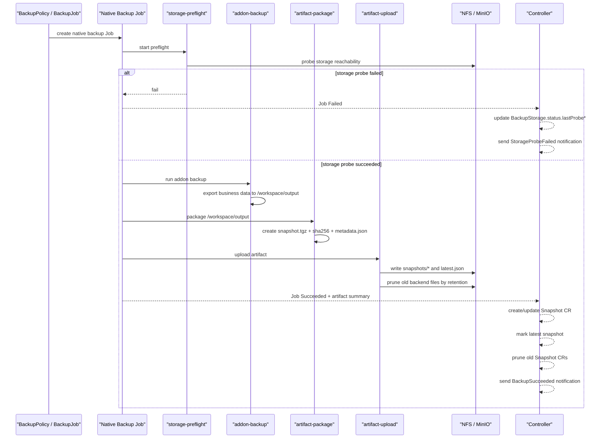
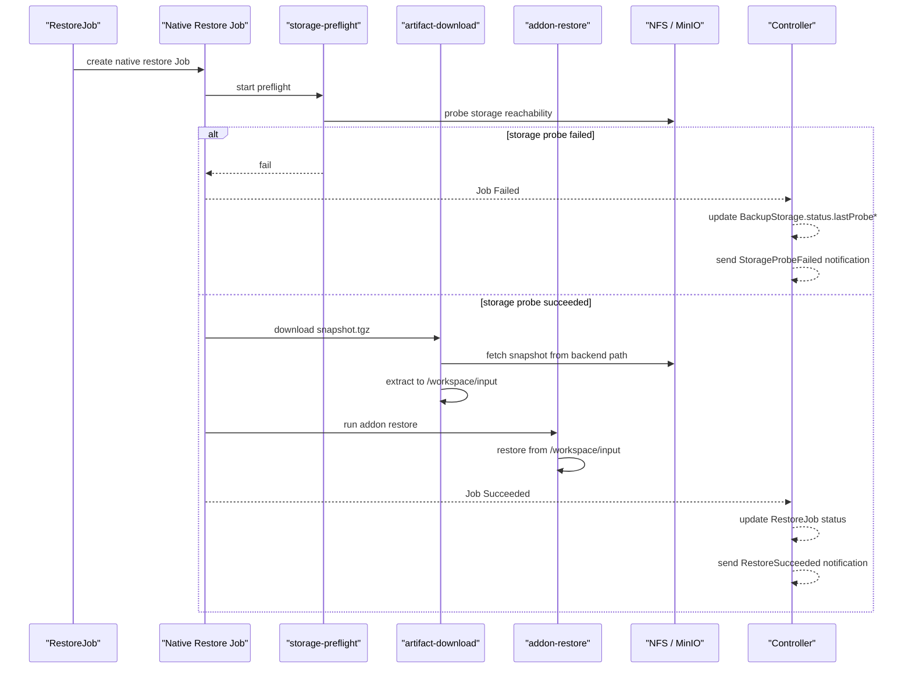

# Execution Flow

## 目的

这份文档专门解释 `dataprotection v2` 里最容易混淆的一点：

- `BackupAddon` 只负责业务数据的导入导出
- `core` 才负责和远端 `NFS / MinIO` 存储系统交互

如果只看 `mysql` / `redis` / `minio` / `milvus` 这些 addon YAML，很容易误以为 addon 自己会去上传下载远端快照。实际上不是这样。

## 一句话结论

可以把 v2 的职责理解成下面两句：

- `BackupAddon` 负责：`源系统 <-> Job Pod 内工作目录`
- `core helper` 负责：`Job Pod 内工作目录 <-> 远端存储`

其中这里的“工作目录”不是宿主机本地目录，也不是 controller 自己的磁盘，而是每次原生 `Job Pod` 里的 `EmptyDir` 临时共享卷。

## 先理解 workspace

在 v2 里，备份/恢复执行发生在 Kubernetes 原生 `Job` Pod 中。

Pod 内会有这些临时目录：

- `/workspace/output`
  - 备份时给 addon 写导出结果
- `/workspace/input`
  - 恢复时给 addon 读快照内容
- `/workspace/status`
  - 各个 helper 容器之间同步状态、传递打包产物信息

这些目录都只是当前 Job Pod 的临时空间，Job 结束后就跟着 Pod 生命周期一起回收，不是长期存储。

## 备份时谁做什么

### addon 做什么

addon 只做业务导出。

比如：

- MySQL addon：执行 `mysqldump`，把 SQL 导出到 `/workspace/output`
- Redis addon：执行 `redis-cli --rdb`，把 RDB 文件写到 `/workspace/output`
- MinIO addon：执行 `mc mirror`，把源对象同步到 `/workspace/output`
- Milvus addon：执行 `milvus-backup create`，把备份目录写到 `/workspace/output`

addon 不负责：

- 探测远端备份存储是否可用
- 把产物上传到 NFS / MinIO
- 维护 `latest.json`
- 删除旧快照
- 创建 `Snapshot` CR

### core 做什么

core 在同一个 backup Job Pod 里自动注入 helper 容器。

备份 Pod 的核心容器链路是：

1. `storage-preflight`
2. `addon-backup`
3. `artifact-package`
4. `artifact-upload`

含义分别是：

1. `storage-preflight`
   - 执行前先探测目标存储
   - `NFS`：检查路径是否能创建、是否可写
   - `MinIO`：检查 endpoint、认证、bucket 是否可访问，可选自动建 bucket
2. `addon-backup`
   - 调用业务 addon，把数据导出到 `/workspace/output`
3. `artifact-package`
   - 把 `/workspace/output` 打包成统一格式
   - 输出：
     - `snapshot.tgz`
     - `sha256`
     - `metadata.json`
4. `artifact-upload`
   - 上传到 `NFS` 或 `MinIO`
   - 写入或更新 `latest.json`
   - 按 retention 删除旧远端文件

## 恢复时谁做什么

恢复 Pod 的核心容器链路是：

1. `storage-preflight`
2. `artifact-download`
3. `addon-restore`

含义分别是：

1. `storage-preflight`
   - 恢复前先确认远端快照存储可达
2. `artifact-download`
   - 从 `NFS / MinIO` 下载 `Snapshot` 对应的 `snapshot.tgz`
   - 解包到 `/workspace/input`
3. `addon-restore`
   - 业务 addon 从 `/workspace/input` 读取内容并恢复到目标系统

所以恢复时也一样：

- addon 只读 `/workspace/input`
- 远端下载依然由 core helper 负责

## 备份执行顺序图

## 恢复执行顺序图

## Snapshot 是什么时候创建的

`Snapshot` 不是 addon 创建的，也不是上传脚本直接创建的。

它是在：

- native backup Job 成功结束之后
- controller 从 Job 对应 Pod 的 termination summary 里拿到 artifact 信息之后

由 controller 统一创建或更新。

这样做的好处是：

- 失败执行不会产生伪 `Snapshot`
- `Snapshot` 只代表“成功且可恢复的资产”
- retention 可以同时清理：
  - 远端旧文件
  - 对应的旧 `Snapshot` CR

## latest / retention 是谁维护的

也是 core 统一维护，不是 addon 维护。

### 远端对象层

上传成功后，core helper 会负责：

1. 写入最新的 `latest.json`
2. 按 retention 删除旧快照文件

### 控制面 CR 层

controller 观察到 Job 成功后，会负责：

1. 创建或更新当前 `Snapshot`
2. 把当前成功快照标记为 `status.latest=true`
3. 按同一条 `series` 删除超出保留窗口的旧 `Snapshot`

所以 retention 是“双层一致”的：

- 后端文件收敛
- Kubernetes 里的 `Snapshot` 记录也收敛

## series 的意义

retention 不是全局乱删，而是按同一条备份序列处理。

当前语义里，`series` 可以简单理解成：

- 同一个 source
- 同一个 policy 或手工 job
- 同一个 storage

也就是说，“保留最新 3 份” 是在同一条 series 里保留 3 份，而不是把别的 source 的快照也一起算进去。

## 通知是在什么时候发

通知也不是 addon 自己发。

通知由 controller 在终态时统一发：

- `BackupSucceeded`
- `BackupFailed`
- `RestoreSucceeded`
- `RestoreFailed`
- `StorageProbeFailed`
- `RetentionPruneFailed`

通知路径是：

- controller 构造标准事件
- 发送到 `notification-gateway`
- gateway 再转发到 webhook 或其他推送渠道

## 为什么要这样设计

这样拆开后有几个明显好处：

### 1. addon 真正解耦

业务插件不再重复实现：

- NFS 上传
- MinIO 上传
- latest 标记
- retention 删除
- 通知发送

它只需要关注自己的数据源怎么导出和恢复。

### 2. 存储逻辑统一

不管是 MySQL、Redis 还是 Milvus，最后面对的都是同一套：

- preflight
- package
- upload
- download
- retention

### 3. 控制面状态统一

`BackupStorage.status`、`Snapshot`、通知结果都由 core 统一维护，不会因为每个 addon 自己写一套逻辑而变得不可控。

## 最后再用一句话总结

备份时：

- addon 把业务数据写到 `/workspace/output`
- core 把它打包并上传到远端存储

恢复时：

- core 先把远端快照下载并解包到 `/workspace/input`
- addon 再从 `/workspace/input` 做恢复

也就是：

- addon 只负责“业务数据进出工作目录”
- core 负责“工作目录和远端存储之间的一切交互”
