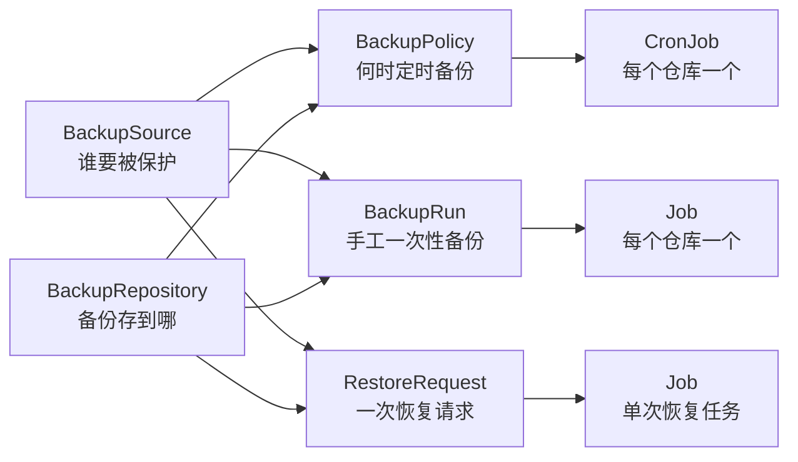

# Data Protection Operator 当前现状说明

## 1. 一句话结论

`dataprotection` 现在已经不是一个纯设计稿了。

它已经具备了一个可安装、可调谐、可观察、可对 MySQL 执行真实备份恢复动作的 `alpha` 级数据保护控制面，但当前真实跑通的数据面只有 MySQL，且以实验室/灰度验证为主，距离“通用多中间件备份平台”还有一段明确的实现路径。

## 2. 项目现在真实做到哪一步

建议把当前能力拆成三层来理解：

| 层次 | 当前状态 | 说明 |
| --- | --- | --- |
| 通用 CRD 模型 | 已完成 | `BackupSource`、`BackupRepository`、`BackupPolicy`、`BackupRun`、`RestoreRequest` 都已经有 API、CRD、校验和状态字段。 |
| 通用控制面 | 已完成 | controller 已具备幂等调谐、子资源创建/更新、状态回填、孤儿资源清理等基础工程能力。 |
| 通用数据面 | 未完成 | Redis、MongoDB、MinIO、RabbitMQ、Milvus 目前只有 schema 和扩展位，还没有内建 runtime。 |
| MySQL 数据面 | 已完成首版 | 已支持 MySQL 逻辑备份、恢复、NFS、S3/MinIO、按库/按表范围、两种恢复模式。 |
| 安装与交付 | 已完成首版 | 支持 GitHub Actions 多架构构建、推镜像、生成离线 `.run` 安装包、默认导入到 `sealos.hub:5000/kube4`。 |

如果用更直白的话说：

- 现在它已经能作为一个 MySQL 备份恢复 operator 去做手工和定时备份。
- 现在它还不能算一个“所有中间件都可用”的通用备份平台。
- 现在它的“通用性”主要体现在控制面模型，而不是运行时能力已经全部通用。

## 3. 当前能力矩阵

| 能力项 | 当前状态 | 备注 |
| --- | --- | --- |
| `BackupSource` / `BackupRepository` 基础状态回填 | 已完成 | 目前是规格校验级别，不是主动连通性探测。 |
| `BackupPolicy -> CronJob` | 已完成 | 一个 repository 对应一个 `CronJob`。 |
| `BackupRun -> Job` | 已完成 | 一个 repository 对应一个一次性 `Job`。 |
| `RestoreRequest -> Job` | 已完成 | 单次恢复请求对应一个恢复 `Job`。 |
| 子 `Job` 状态回填到 CRD | 已完成 | `Pending` / `Running` / `Succeeded` / `Failed` 已可聚合。 |
| 幂等重入 | 已完成 | 重复 reconcile 不应重复创建相同子资源。 |
| 陈旧子资源清理 | 已完成 | `BackupPolicy` 仓库列表收缩后，会删除不再需要的 `CronJob`。 |
| MySQL 逻辑备份 | 已完成 | 基于 `mysqldump`，产物为 `.sql.gz`。 |
| MySQL 恢复 | 已完成 | 支持从 `.sql.gz` 恢复。 |
| MySQL + NFS | 已完成 | 通过 NFS 挂载直接读写备份产物。 |
| MySQL + S3/MinIO | 已完成 | 通过 `mc` helper 做预拉取、上传、下载。 |
| MySQL 按库备份 | 已完成 | `driverConfig.mysql.databases`。 |
| MySQL 按表备份 | 已完成 | `driverConfig.mysql.tables`，格式为 `database.table`。 |
| MySQL `merge` 恢复 | 已完成 | 不先全量清空所有用户库。 |
| MySQL `wipe-all-user-databases` 恢复 | 已完成 | 先清空所有用户库再恢复，破坏性较强。 |
| 备份产物元数据与校验和 | 已完成 | 会生成 `latest.txt`、`.meta`、`.sha256`。 |
| 保留策略 `keepLast` | 已完成 | 当前在 MySQL 运行时内执行旧快照清理。 |
| 在线发布到 Docker Hub / 阿里云 | 已完成 | 通过 GitHub Actions。 |
| 多架构 `.run` 离线包 | 已完成 | `amd64` / `arm64`。 |
| Redis/Mongo/MinIO/RabbitMQ/Milvus 内建 runtime | 未完成 | 仅有字段模型，不能承诺可用。 |
| Admission webhook | 未完成 | 当前依赖 controller 运行期校验。 |
| 独立备份校验执行链路 | 部分完成 | `verification` 字段已建模，但还没有单独的通用校验 controller / runner。 |
| 定时备份的 CRD 级历史记录 | 未完成 | 当前定时流直接创建 `CronJob`，不会额外生成 `BackupRun` 历史对象。 |
| `NextScheduleTime` 精确回填 | 未完成 | 当前 `BackupPolicy.status.nextScheduleTime` 还没有完整回填逻辑。 |

## 4. 当前对象模型怎么理解

这 5 个对象建议这样记：

- `BackupSource`
  说明“谁要被保护”，也就是数据源本身。
- `BackupRepository`
  说明“备份存到哪”，也就是 NFS 或 S3/MinIO。
- `BackupPolicy`
  说明“什么时候、按什么规则定时备份”，也就是长期策略。
- `BackupRun`
  说明“我要手工触发一次备份”，也就是一次性请求。
- `RestoreRequest`
  说明“我要发起一次恢复”，也就是一次性恢复请求。

可以用下面这张图来理解：

## 5. 真实业务逻辑

### 5.1 定时备份链路

当前定时备份不是“`BackupPolicy` 自动生成 `BackupRun`”，而是：

`BackupPolicy -> CronJob`

并且是：

- 一个 `BackupPolicy`
- 关联多个 `BackupRepository`
- controller 为每个 repository 渲染一个独立 `CronJob`

这意味着：

- 多中心备份已经成立，因为一个 policy 可以挂多个 repository。
- 多 repository 的调度是分开的，每个 repository 有自己对应的 `CronJob`。
- 当前定时历史主要体现在 `CronJob/Job` 资源上，而不是额外的 `BackupRun` CRD 记录。

### 5.2 手工备份链路

手工备份走：

`BackupRun -> Job`

也是一个 repository 一个 `Job`。  
如果 `BackupRun.spec.policyRef` 指向某个 policy，它会继承该 policy 的执行模板和部分策略参数。

### 5.3 恢复链路

恢复走：

`RestoreRequest -> Job`

恢复可以从两类来源选：

- 直接指定 `repositoryRef + snapshot`
- 指定 `backupRunRef`，再从 `BackupRun.status.repositories[].snapshot` 中推导快照

### 5.4 MySQL 当前的真实执行方式

当前内建 MySQL runtime 的核心特征是：

- 用 `mysqldump` 做逻辑备份
- 产物是 `.sql.gz`
- 恢复时用 `mysql` 客户端导回
- NFS 仓库直接读写共享目录
- S3/MinIO 仓库用 helper 容器同步本地工作目录和对象存储

当前备份目录逻辑为：

- NFS 根目录下：`backups/mysql/<namespace>/<source-name>/`
- S3/MinIO 前缀下：`<prefix>/backups/mysql/<namespace>/<source-name>/`

通常你会看到这些文件：

- `snapshots/<snapshot>.sql.gz`
- `snapshots/<snapshot>.sql.gz.sha256`
- `snapshots/<snapshot>.meta`
- `latest.txt`

## 6. 目前最重要的工程特性

这部分是“为什么它已经不再只是脚本”的关键。

### 6.1 幂等性

当前 controller 已经按幂等思路实现：

- 重复 reconcile 不重复创建同名子资源
- 同一个 `BackupPolicy` 重复 apply，不会无限叠加 `CronJob`
- 同一个 `BackupRun` / `RestoreRequest` 重复 reconcile，不会重复创建新的名字

### 6.2 稳定命名

子资源命名已经做了稳定化处理，避免长名字超长和随机漂移，便于：

- 审计
- 排障
- 重试
- 重入

### 6.3 状态回填

当前状态字段已经可以支撑基本排障：

- `BackupSource` / `BackupRepository` 会回填 `Phase`、`Conditions`
- `BackupPolicy` 会回填 `CronJobNames`
- `BackupRun` 会回填 `JobNames`、每个 repository 的状态与快照
- `RestoreRequest` 会回填 `JobName`

### 6.4 离线交付

现在仓库不仅能本地开发，也能形成正式交付物：

- GitHub Actions 构建多架构镜像
- GitHub Actions 构建多架构 `.run`
- `.run` 支持把镜像导入并 retag 到目标仓库
- 默认目标仓库已经切到 `sealos.hub:5000/kube4`

## 7. 当前边界和容易误解的点

这部分非常重要，手工验收时要按这个边界来理解结果。

### 7.1 `BackupSource Ready` 不等于源端连通

当前 `BackupSource` / `BackupRepository` 的 `Ready`，本质上是：

- spec 合法
- 必填字段齐全
- 字段组合合理

它当前**不是**：

- 实际 TCP 连通性探测
- 实际认证成功探测
- 实际 NFS / S3 可访问性探测

所以出现下面这种情况是符合当前实现的：

- `BackupSource.status.phase=Ready`
- 但真正执行备份 `Job` 时，因为网络、凭证或权限失败

### 7.2 MySQL 当前是“逻辑备份首版”，不是“通用物理备份平台”

虽然 schema 里保留了 `mysql.mode` 这样的扩展位，但当前内建 runtime 的真实落地仍然是：

- `mysqldump`
- `.sql.gz`
- 逻辑恢复

也就是说，**现在不要把它理解成已经支持 XtraBackup 一类的物理备份链路**。

### 7.3 `merge` 不是“完全无影响恢复”

当前 `merge` 的含义是：

- 不先全量清空所有用户数据库

但因为导入内容本身来自 `mysqldump`，其中仍可能包含会覆盖同名对象的 DDL/DML。  
所以它更准确的理解是：

- 不做全库级“先清空再恢复”
- 但对 dump 里涉及的对象，依然可能发生覆盖

### 7.4 当前定时历史不落 CRD

现在定时备份不会自动沉淀为 `BackupRun` CRD 历史对象。  
如果你后续要更强的审计、统计和回放能力，这一块后面还可以继续演进。

### 7.5 通用控制面已经有了，通用 runtime 还没有

所以现在更准确的项目定位应该是：

- 一个通用的数据保护 operator 骨架与控制面
- 搭配一个已经可用的 MySQL 首个内建 driver

而不是：

- 一个所有数据库/中间件都已经完成的通用备份平台

## 8. 现在最值得你手工验证的内容

如果你的目标是判断“项目现在靠不靠谱、哪些能力是真有的”，建议按这个顺序验：

1. 安装链路是否稳定
2. CRD 与 controller 是否正常工作
3. `BackupPolicy` 是否会稳定地产生多 repository `CronJob`
4. `BackupRun` 是否真的能把 NFS / S3 两边都备份成功
5. 备份产物是否真的落盘，且附带 `meta`、`sha256`、`latest.txt`
6. `RestoreRequest` 是否真的能恢复出正确数据
7. 幂等场景下是否会重复创建脏资源
8. 故障场景下状态和日志是否足够清楚

## 9. 当前阶段的建议定位

按我的规划，当前项目最合适的对外定位是：

**一个以 MySQL 为首个落地 driver 的通用数据保护 operator alpha 版。**

这个定位的好处是：

- 不会低估它，毕竟它已经不是简单 shell 脚本
- 也不会高估它，避免把未实现的多 driver 能力提前承诺出去

如果后续继续演进，比较自然的路线是：

1. 先把 MySQL 的验收、稳定性、可观测性补足
2. 再补 `BackupSource` / `BackupRepository` 的主动探测能力
3. 再补定时历史记录、校验链路和 webhook
4. 最后再把 Redis、MongoDB、MinIO 等 driver 逐个接上
